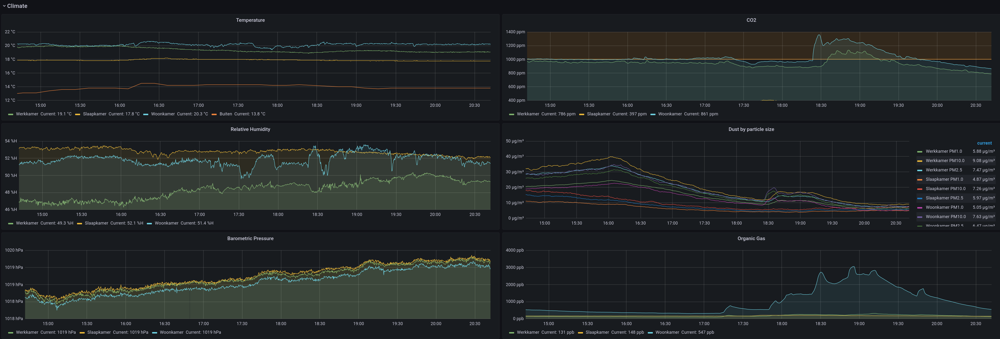

ESP32 Sensornode
================

This is code for an ESP32 to export the data from a bunch of sensors over
Prometheus via a web server.

Supported peripherals:
* BME280 (relative humidity, temperature, barometric pressure)
* Interrupt based Geiger counters (ionizing radiation)
* MH-Z19 (CO2)
* PMS7003 (fine dust)
* PZEM-004T v3 (AC power)
* SGP30 (volatile organic gas)
* NPN Sensor based water consumption

Peripherals and configs are selected through platformio.ini.

